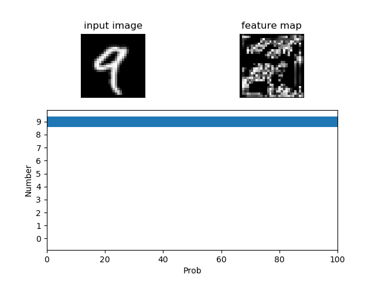

# MNIST Visualizer
The visualizer for classification of handcrafted digits image.



## Quick Start
First of all, clone the repository:
```
git clone https://github.com/HanyangTechAI/MNIST-Visualizer
cd MNIST-Visualizer
```

### 1. Training
You need to train network with MNIST dataset to use this program. To train network, shell below command.

```
python trainer.py
```

Trained weights will be saved in checkpoint directory.

### 2. Visualize
You can visualize classification with below command.
```
python main.py <image> <model>
```

**e.g**
```
python main.py test.png checkpoint/checkpoint-0001.bin
```


## Contact
You can contact me via e-mail (jyp10987 at gmail.com) or github issue.
